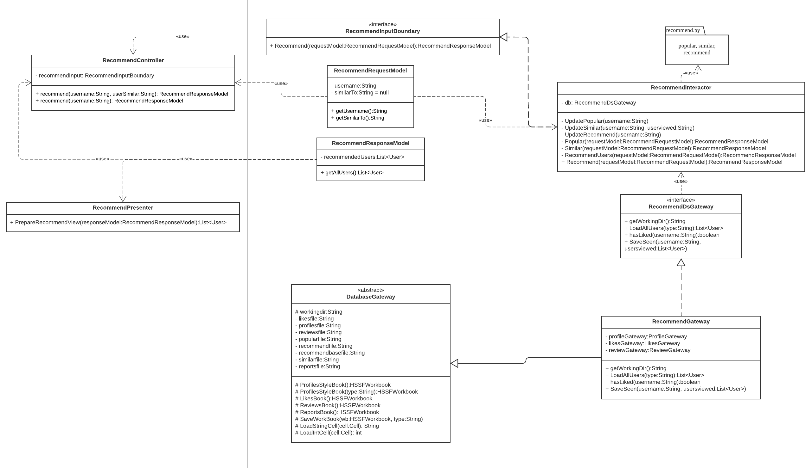

# 2022 Fall CSC207H1 Group 127 Project: LinkedOut

A versatile modern dating application for all your relationship needs! The interface is based on Java Swing.

**Notes**:
- This app can only accommodate MacOS system!!!
- The Apache Excel POI package and a Python interpreter are required to run this program. The link to the Apache package is under src/"Package required for accessing database".

## Group members:
Joe Cui, Clara Hu, Tristal Li, Ryan Shi, Michelle Xu, Alex Yin, Yifei Zhang.

## Project outline

- Yanlin Li: Recommend User Case, Gateway
- Yifei Zhang
- Ryan Shi
- Chensheng Xu
- Qingyi Hu
- Zezhou Cui
- Weilin Yin: User Manager Use case, User, RegularUser, VipUser

## Project outline:

### Entities

- The central entity is the account. Its childen are Admin and Profile, which in turn has children User, RegularUser, and VipUser.

### Use cases / functionality

#### Recommend Use Case

For a dating app, it is important to recommend users with other users that they may be interested in. 
This use case implements the functionality of recommending other users to the given user. 

For example, you enter the main page and pressed the recommend button, the app can automatically 
recommend a group of other users that you may be interested in and has never seen before
based on our data about you and other users. Based on your gender and sexuality information, the app
will only recommend you those with the gender you usually date with. 

There are two forms of recommendation: **"similar"** and **"recommend"**

##### Similar

When user A is interested in finding similar users to user B, he or she can hit "Similar" button. The app
will then call a K-Nearest-Neighbours model. The model will consider the "liking patterns" (which group of 
users "liked" them) for user B, and then find 20 users who are liked by a similar group of users. 
Finally, the app will display those similar users with the desired gender.

##### Recommend

We have two kinds of recommendation algorithms designed for two kinds of users

1. **New users (never "Liked" any other users before):** We automatically recommend a group of popular users 
(mostly seen by others) of the desired gender to them and display the list on the main screen. 

2. **Old users (has "Liked" other users before):** We use Collaborative Filtering based on K-Nearest-Neighbours 
to find out the users they may like. For recommendation to user A, the algorithm will first automatically pick several 
users with the highest ratings from A. If A hasn't reviewed anyone before, the app will randomly pick 
some users A has "liked" as the basis of recommendation. Based on our database, the K-Nearest-Neighbours model 
will pick 10 users with similar "liking patterns" (liked by similar group of users) for each selected basis user, 
filter out the users who have already been seen, and combine to a maximum of 40 users to recommend. After that, the 
app will display the users with the desired gender. 

#### Review usecase

>1. When two users liked each other, they can write reviews for each other
>2. A review object contains: int rating, String comment, String writer (writer’s name), String receiver (receiver’s name), int id
>3. Create a review: input writer’s name, receiver’s name, comment and rating
>4. Delete a review: input the review’s id
>5. Hide a review (VIP): input the review’s id (to be implemented later)

##### Classes

>ReviewController\
>ReviewRequestModel
ReviewInputBoundary\
ReviewInteratcor\
ReviewGateway
ReviewGatewayImplementation
ReviewOutputBoundary\
ReviewPresenter\
ReviewResponseModel

##### How the code works

>The add review’s flow goes like this: when the ReviewController takes in the input information from the screen, it then
> constructs a ReviewRequestModel and puts all input information into the request model, it then calls ReviewInputBoundary
> to add the review to the system. The ReviewInteratcor which implements ReviewInputBoundary will construct the review
> object, call the ReviewGateway to save the review to the database, and call ReviewOutputBoundary to report the success
> of adding the review, and the ReviewPresenter which implements the ReviewOutputBoundary will execute the implemented
> method and return a ReviewResponseModel.

>The delete review’s flow is basically the same. It’s just now a request model is not needed since the user only need to
> input the review’s id to delete it.

#### User Use Case

- User inputs the account name of the user and click `Confirm` first, then click `Profile` button to view this user's profile
- Click `Liked` to view all users liked by the current user
- Click `Status` to view the account status, including Vip Status (boolean), Restriction Status (boolean), and Restriction Duration(float)
- Click `Show Review` to view all the reviews the current user received
- Click `Delete Review` to delete specific review by inputting id of the review
- Click `Upgrade` to upgrade a Regular User to VIP user
- Click `Like Me (VIP)` to display all users the current user has liked (Function only available for VIP User)
- Click `Set Invisible` to set the current user to invisible (Function only available for VIP User)

### Design patterns

We have implemented the Factory design pattern for the User entity.

#### Recommend Use Case
Here is the UML for Recommend Use Case

### Testing:

#### Recommend Use Case

### Testing

Our testing code coverage is displayed in the following screenshot:

### Looking forward

We surmise that we can extend our project by [].
